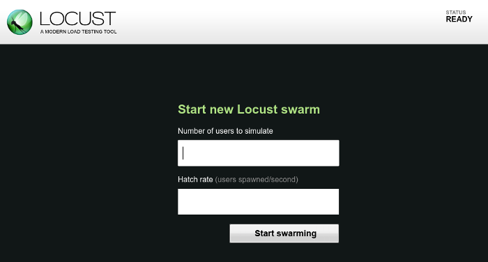
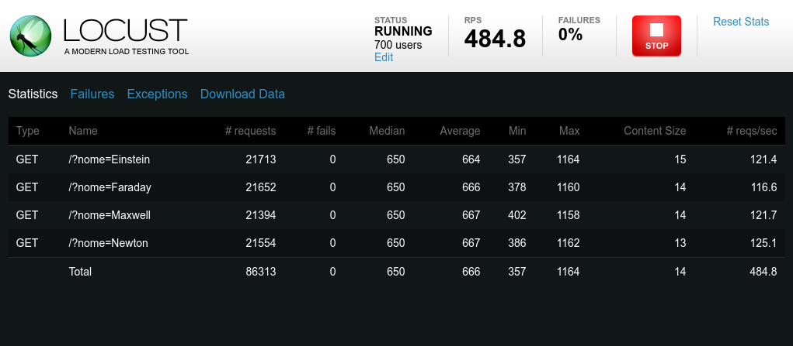

# Locust.io e a primeira onda!

Já imaginou um belo dia por alguma razão inesperada ou esperada milhares de pessoas resolverem acessar o seu site? Aí vem a pergunta, como se preparar?

Para ajudar a se preparar vamos aprender um pouco sobre uma ferramenta muito simples para realizar os testes de carga, o [**Locust**](http://locust.io).

Pretendo dividir essa série em 4 artigos:

1. A primeira onda: Vamos conhecer um pouco do Locust e fazer nosso primeiro teste.
2. Atacando com várias ondas: Veremos como executar um teste distribuído em várias máquinas.
3. Usando o Python: Usaremos a artilharia do Python para realizar testes mais elaborados.
4. Modificando genéticamente nossos gafanhotos: Será a hora de adicionarmos novos recursos aos nossos testes.

Agora vamos para a primeira parte da série!

# A primeira onda: Introdução

Executar uma simulação de centenas ou milhares de usuários por si só já é um problema considerável, existem várias ferramentas mas um diferencial do Locust é que ele torna a tarefa muito simples. A primeira característica é como você deve escrever as simulações. Se você gosta de [Python](https://www.python.org) é hora de [brilhar](https://youtu.be/lbGJfTMxlfU),  tudo o que você precisará fazer é programar em Python!

A segunda característica que torna o Locust interessante é a forma como ele [simula centenas ou milhares de usuários](http://docs.locust.io/en/latest/what-is-locust.html), por exemplo, diferentemente do [JMeter](http://jmeter.apache.org) que usa uma *thread* para cada usuário o Locust é um [sistema de eventos](http://www.gevent.org) baseados em [*micro-threads*](https://greenlet.readthedocs.io/en/latest/), complicado? Talvez, simplificando bastante o Locust internamente trabalha com eventos, como o objetivo desse artigo não é esgotar esse assunto darei uma dica de como é isso, imagine que você pede para alguém abrir uma porta para você e quando essa pessoa abrir essa porta ela volta para te avisar, enquanto isso você pode pedir para outras pessoas abrirem outras portas, é mais ou menos por aí, toda comunicação que o locust faz com a sua aplicação opera de uma forma mais ou menos parecida com esse exemplo. As *micro-threads* é que ao invés do Locust solicitar ao **SO** uma *thread* e rodar cada simulação em uma *thread* o Locust solicita algumas e dentro de cada *thread* o Locust executa algumas *micro-threads*. Dessa forme ele é capaz de simular muitos usuários de forma confiável.

## Python

Se você como eu não está habituado a programar em Python recomedo o ótimo [Python para Desenvolvedores](http://ricardoduarte.github.io/python-para-desenvolvedores/), lá você poderá aprender rapidamente a dar seus primeiros passos em Python e se você quiser mais informações também recomendo a [documentação oficial](https://docs.python.org/2.7/index.html).

# Os primeiros passos

Okay! Um pouco de pragmatismo não faz mal a ninguém, então vamos começar a diversão!

## Instalação

Você precisará do Python 2.7 instalado em seu sistema para iniciar.

### Linux e \*nix

Python já vem instalado em praticamente todas as distribuições Linux, mas caso você seja uma pessoa exótica ou goste de distribuições exóticas dê uma olhada aqui [Using Python on Unix platforms](https://docs.python.org/2.7/using/unix.html#on-linux).

### Mac OS

Agora se você é fã da maçã o Python também já está lá, mas caso queira mais alguns detalhes aqui vai um link [Using Python on a Macintosh](https://docs.python.org/2.7/using/mac.html).

### Microsoft Windows®

Se você é um desenvolvedor windows aí será necessário instalar o Python [Using Python on Windows](https://docs.python.org/2.7/using/windows.html).

### Instalando o Locust

O jeito mais fácil de instalar o Locust é através do [PyPi](https://pypi.python.org/pypi). Então você apenas precisará executar isso no seu terminal:

> pip install locustio

Caso você se depare com alguma mensagem de comando não encontrado você pode ver [aqui](https://pip.pypa.io/en/latest/installing/) algumas dicas de como instalar o pip.

#### Algumas observações

No [*Arch Linux*](https://www.archlinux.org) o comando para instalar o Locust é **pip2**. A razão disso é que nessa distribuição tanto o Python 3 e Python 2.7 já estão instalados então é comum que os comandos relacionados ao python por default façam referência a versão 3, nesse caso sempre há versões dos comandos específicas para o Python 2.7, então aqui precisei instalar da seguinte forma:

> pip2 install locustio

Outra observação é que no *Arch Linux* o pip2 tenta instalar o locust como um comando de sistema, ou seja, ele precisará de poderes de *root* e nesse caso foi necessário usar o **sudo**:

> sudo pip2 install locustio

Se você tiver algum problema talvez no seu sistema a solução seja a mesma que usei para instalar no meu sistema.

## Uma vez instalado...

Agora que você já tem o Locust instalado é hora de iniciar a simulação ou o ataque, a diferença pode ser bem sutil. O Locust é instalado como um comando então você a princípio precisará apenas digitar:

> locust -H http://localhost:8080

## O locustfile

Se você reparou só informei um endereço http, por padrão o Locust procura no caminho atual o arquivo locustfile.py, esse é o locustfile. O locustfile é um arquivo com o código python do seu teste e a única exigência é que o arquivo tenha uma classe Locust e essa classe representará um usuário, ou um gafanhoto. Para explicar como fazer um teste acredito que a melhor maneira seja fazendo um teste, então vamos para o consegrado ["Hello, World!"](https://pt.wikipedia.org/wiki/Programa_Olá_Mundo).

Nessa série usarei o [Node.js](https://nodejs.org) para escrever as aplicações que serão testadas, os códigos fonte podem ser acessados no nosso [repositório](https://github.com/Lemaf/artigo-locust/tree/artigo-1) no github.

A primeira aplicação (o código fonte está [aqui](https://github.com/Lemaf/artigo-locust/blob/artigo-1/hello_world.js)) que será testada é um servidor HTTP que responderá a requisições GET com a uma *string* `Hello, <nome>!`, no caso `<nome>` é um parâmetro enviado na *query string* da *URL*.

Então uma requisição como:

> GET /qualquercoisa?nome=World

Deverá ser respondida com um:

> Hello, World!

Como testar? A seguir um exemplo de teste.

```python
from locust import HttpLocust, TaskSet, task
import random

class PrimeiroTeste(TaskSet):
   @task
   def test_01(self):
      nome = random.choice(('Einstein', 'Newton', 'Maxwell', 'Faraday'))
      with self.client.get('/', catch_response = True, params = {'nome': nome}) as response:
         if response.text == ('Hello, %s!' % nome):
            response.success()
         else:
            response.failure('Resposta inesperada!')

class HelloWorld(HttpLocust):
   task_set = PrimeiroTeste
   min_wait=50
   max_wait=1000

```

### Entendendo o código...

Como testar no Locust é programar em python algumas bibliotecas serão necessárias. O primeiro *import* é fundamental, veja que importei as classes **HtppLocust** e **TaskSet** e o [decorator](http://nbviewer.jupyter.org/github/ricardoduarte/python-para-desenvolvedores/blob/master/Capitulo17/Capitulo17_Decoradores.ipynb) **task**.

Vejamos o que importamos:

* **HttpLocust** É a classe base dos nossos testes.
* **TaskSet** Como o próprio nome diz é o conjunto de tarefas.
* **task** É um *decorator*, de forma muito simples um decorator é uma função que altera outras funções, podemos dizer que o seu teste é *decorado* por esse carinha.

#### *HttpLocust*

Todo arquivo locust deve ter uma classe que seja herdeira da **HttpLocust**, isso para testes *HTTP* mas isso é uma conversa para outro momento na série. Nessa classe você precisa definir um conjunto de tarefas que serão executadas e isso é feito através do atributo *task_set* onde definimos que o conjunto de tarefas é a classe *PrimeiroTeste*.

Os atributos *max_wait* e *min_wait* controlam o intervalo, em milisegundos, entre os testes. Lembre-se para o Locust a sua classe **HttpLocust** determina o comportamento de cada usuário.

O atributo *task_set* pode definir mais de um conjunto de atividades, novamente vamos explorar isso nos próximos passos da nossa série.

#### *TaskSet*

Nessa classe fazemos o teste acontecer.

```python
class PrimeiroTeste(TaskSet):
   @task
   def test_01(self):
      ...
```

No exemplo usei o *decorator* *task* no método `test_01`, isso informa ao Locust que esse método é uma tarefa do teste, você pode definir mais de um método como tarefa.

Estou considerando que você sabe alguma coisa de *Python* ou está lendo a dica do livro que passei!

```python

nome = random.choice(('Einstein', 'Newton', 'Maxwell', 'Faraday'))
with self.client.get('/', catch_response = True, params = {'nome': nome}) as response:

```
Para fazer o teste a primeira coisa que faço é escolher um nome dentro de alguns conhecidos, feito isso uso o atributo `client`, que é do tipo **HttpSession** da *API* do Locust, e faço uma requisição *GET*, os valores da *query string* são fornecidos pelo parâmetro `params`. Para se utilizar a instrução `with` do *python* eu preciso que o retorno desse método seja um [*Statement Context*](file:///usr/share/doc/python2/html/reference/compound_stmts.html#the-with-statement) e para instruir o Locust a retornar um objeto desse tipo devemos usar o parâmetro `catch_response` (*Python* tem tipagem é dinâmica), qual a razão de utilizar isso? Dessa forma não preciso escrever um código com `try: ... catch: ...` para o caso de algo errado acontecer com a requisição.

Se você notar bem deve ter reparado que fiz a requisição assim `self.client.get('/')` e eu poderia ter colocado algo como `self.client.get('/algumacoisa')` mas não disse onde a aplicação está sendo executada! Lembra do parâmetro `-H` lá do começo? Ele dá a *URL* base para o nosso teste, então algo como `self.client.get('/algumacoisa')` faz uma requisição para `http://localhost:8080/algumacoisa`, mais uma coisinha para facilitar o desenvolvimento e execução em outras ambientes.

```python

if response.text == ('Hello, %s!' % nome):
      response.success()
   else:
      response.failure('Resposta inesperada!')

```

Feita a requisição preciso testar, aqui nesse exemplo apenas testei a *string* retornada por minha aplicação. Outros testes podem ser feitos como checar o *status* da resposta, cabeçalhos e etc.

### Um primeiro teste

Foi relativamente fácil programar o teste, só que precisamos ver o teste funcionando. Depois de escrever o locustfile agora é voltar para o terminal e executar o locust:

> locust -H http://localhost:8080

Se você escreveu o arquivo corretamente você verá a seguinte mensagem no seu terminal:

> .../INFO/locust.main: Starting web monitor at \*:8089
>
> .../INFO/locust.main: Starting Locust 0.7.5

Corra para o seu navegador favorito e acesse [http://localhost:8089](http://localhost:8089) e você verá a seguinte tela.



Nessa tela o Locust pergunta quantos usuários você quer simular (*Number of users to simulate*) e também conforme o teste vai sendo executado quantos novos usuários serão iniciados a cada segundo (*Hatch rate*), se você quiser dizer que a cada dois segundos chega um novo usuário aqui você deverá dizer 0.5, meio estranho né? Nem tudo é perfeito.

Feito isso aí sim você verá os seus testes sendo executados, a interface se atualiza conforma as coisas vão acontecendo.



Veja que a interface é bem simples de acompanhar, então não preciso explicar muito como usar.

## É preciso estressar o seu código!

Aqui gostaria de chamar a atenção, tanto a sua leitor como a minha, para a necessidade de estressar os códigos que fazemos.
Algumas soluções podem aparentemente funcionar muito bem em ambiente de testes generosos mas eventualmente seu problema pode crescer exigindo mais memória e/ou poder de processamento e solucionar pedindo mais não dá muito certo não. Então para exemplificar farei aqui um pequeno teste, detectar o problema, pensar numa solução e testar essa solução e ficar aliviado que a solução atendeu o problema.

### Situação hipotética

Imagine que você criou uma aplicação que em algum momento precisa realizar um cálculo com uma complexidade linear. Como o algoritmo é muito simples você optou por uma solução inocente e implementou ele da forma que aparentou mais acertada, okay, implementação feita os *testers* entram em campo e eles aprovam, o pessoal que faz a homologação faz os seus testes o sistema foi para o ar.

Para exemplificar o teste farei uma aplicação Node.js ridiculamente simples que receberá um número na *query string* e usará esse número como parada em um `for`.

Quando eu solicito:

> GET /?numero=5000

Recebo:

> Foram processados 5000 dados!

O código fonte está disponível [aqui](https://github.com/Lemaf/artigo-locust/blob/artigo-1/for_lento.js).

Agora é hora de testar o nosso sistema hipotético, como já aprendemos o básico do locust faremos um CTRL+C CTRL+V maroto.
